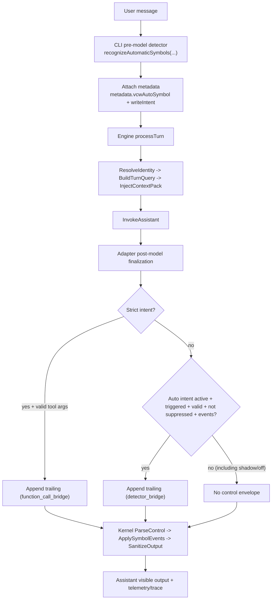

# virtual-context-window

To install dependencies:

```bash
bun install
```

To run default entrypoint:

```bash
bun run index.ts
```

Interactive chat CLI:

```bash
bun run chat:interactive --mock
```

Chat CLI auto-symbol mode defaults to `shadow` (detect-only, no passive writes). In-session controls:

```text
/auto status
/auto on
/auto shadow
/auto off
```

One-shot chat (local mock):

```bash
bun run chat:interactive --mock --once "hello"
```

One-shot chat (live Ollama):

```bash
VCW_OLLAMA_MODEL=<your_model> VCW_OLLAMA_BASE_URL=<your_url> bun run chat:interactive --once "hello live" --trace
```

Agent CLI (mock):

```bash
bun run agent:interactive --mock
```

Agent CLI auto-symbol mode defaults to `active` (passive writes allowed for high-confidence durable facts). In-session controls:

```text
/auto status
/auto on
/auto shadow
/auto off
```

One-shot agent (mock):

```bash
bun run agent:interactive --mock --once "hello agent"
```

One-shot agent (live Ollama + embeddings):

```bash
VCW_OLLAMA_MODEL=<your_model> VCW_OLLAMA_EMBED_MODEL=<your_embed_model> VCW_OLLAMA_BASE_URL=<your_url> bun run agent:interactive --once "remember phase seven" --trace
```

Auto-mode env controls:

```bash
VCW_AUTO_SYMBOL_MODE=off|shadow|active
VCW_AUTO_SYMBOL_ACTIVE_MIN_SCORE=0.70
VCW_AUTO_SYMBOL_SHADOW_MIN_SCORE=0.45
```

Phase 8 flow (detector + control envelope):



Notes:
- `shadow` means detect-only: decision/diagnostics are recorded, but no envelope is appended and no write occurs.
- The detector runs pre-model; envelope append decision is applied post-model from detector metadata.

createAgent bridge (Phase 6 compatibility surface):

```ts
import { createAgent } from "langchain";
import {
  buildVcwCreateAgentMiddlewareSpec,
  toLangChainAgentMiddleware,
} from "virtual-context-window";

const specs = buildVcwCreateAgentMiddlewareSpec({
  middleware: [
    {
      name: "audit",
    },
  ],
  adapter: {
    buildContext: (request) => ({
      request: { messages: [] },
      threadId: "thread-a",
      trustedSymbolRefsEnabled: false,
      query: { queryText: "", queryTokens: [], turnsUsed: 0 },
      contextPackText: "",
      prompt: String((request as { prompt?: string }).prompt ?? ""),
      startedAtMs: Date.now(),
    }),
    extractModelOutputText: (result) =>
      String((result as { outputText?: string }).outputText ?? ""),
    assignModelOutputText: (result, outputText) => ({
      ...(result as Record<string, unknown>),
      outputText,
    }),
  },
});

const middleware = toLangChainAgentMiddleware(specs);

const agent = createAgent({
  model: "ollama:gpt-oss:20b",
  tools: [],
  middleware,
});
```

This project was created using `bun init` in bun v1.3.0. [Bun](https://bun.com) is a fast all-in-one JavaScript runtime.
