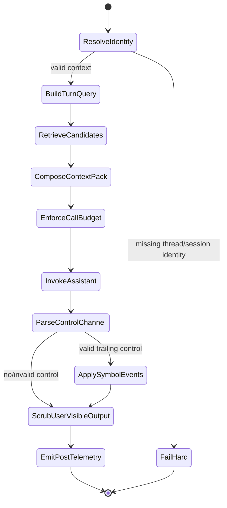

# Greenfield Virtual Context Window Engine V2 Specification

## Document Control
- Status: Approved for MVP build kickoff
- Intended audience: Platform/agent engineers and autonomous coding agents
- Timebox target: MVP in 4-6 weeks
- Baseline assumptions date: February 13, 2026

## 1) Problem Framing and Non-Goals
### Problem framing
Context-heavy agent systems fail when they repeatedly stuff prior interaction state into prompt context. This creates:
- Context pressure
- Rising latency and cost
- Recall dilution
- Weak memory governance

Engine V2 solves this by maintaining durable symbol memory and injecting only a bounded, relevance-ranked working set per turn, with strict one assistant-generation call semantics.

### Non-goals
- Infinite perfect memory
- Multi-call chain-of-thought orchestration
- Replacing application-level domain retrieval systems
- Eliminating all retrieval error (goal is measurable containment)
- Embedding provider lock-in

## 2) System Invariants
1. Exactly one assistant-generation call per turn.
2. Control writes are accepted only via strict trailing wrapped `symbolic_control` block.
3. Only `upsert_symbol` events are accepted in MVP.
4. Thread isolation is default; shared memory is opt-in and policy-gated.
5. Context pack must never exceed configured total budget.
6. Fail-open for malformed model control output (user response still returns safely).
7. Every turn emits structured pre-model and post-model telemetry.
8. Validation and release are KPI-gated, not anecdotal.

## 3) End-to-End Engine State Machine


### State transition rules
- `FailHard` is only allowed for preconditions that violate runtime contract (identity, severe config corruption).
- Retrieval/model write issues are non-fatal unless policy explicitly requires fail-fast.
- Post-model sanitize always runs before response returns.

## 4) Read Path Internals
### 4.1 Query builder
Inputs:
- Last user utterance
- Optional bounded recent user turn window
- Trust context

Output:
- Deterministic retrieval query string
- Query tokens
- Diagnostics (`historyTurnsUsed`, `queryChars`)

### 4.2 Candidate retrieval
Strategies:
- `lexical_v1`: token overlap scoring
- `hybrid_v2`: lexical + embedding + recency fusion

Candidate flow:
1. Candidate pool fetch (bounded)
2. Lexical scoring
3. Vector scoring (if provider available and policy allows)
4. Fusion rerank
5. Confidence gate

### 4.3 Context-pack composition
Ordered sections:
1. `SYMBOL INDEX`
2. `FOCUSED MEMORY`
3. `SEMANTIC RECALL`

Composer rules:
- Stable ordering
- Deterministic truncation
- Bounded recall count
- Anchor extraction for recall grounding

## 5) Write Path Internals
### 5.1 Control parse and validation
Accepted wire format:
```xml
<symbolic_control>{"symbol_events":[...]}</symbolic_control>
```

Validation constraints:
- Must be trailing final non-whitespace output
- JSON parse success required
- Schema must include `symbol_events` array
- Event type must be `upsert_symbol`
- Content length and event count limits enforced

### 5.2 Event application policy
For each accepted event:
1. Chunk oversized content
2. Compute summary fallback if missing
3. Upsert symbol(s) with metadata (`chunkIndex`, `chunkCount`, `source`, `keyHint`)
4. Record success/failure outcome

### 5.3 Output hygiene
Always sanitize user-visible output:
- Remove control-channel leak artifacts
- Remove symbol-token echoes unless explicit trusted debug policy allows otherwise

## 6) Memory Model
### 6.1 Scope model
- Primary plane: thread-local symbols
- Optional plane: shared symbols (policy-enabled)

### 6.2 Symbol record model
Fields:
- `symbolId`, `summary`, `content`, `kind`
- `createdAt`, `updatedAt`
- Optional metadata (`keyHint`, chunk markers, source)

### 6.3 Isolation model
- Thread ID required for all default operations
- Shared plane access requires explicit policy and telemetry attribution

## 7) Retrieval Model
### 7.1 Lexical retrieval
- Tokenization with stopword filtering
- Overlap-based similarity for deterministic fallback

### 7.2 Hybrid retrieval
- Embedding provider interface (pluggable)
- Ollama adapter as default reference
- Fusion score = weighted lexical + vector + recency

### 7.3 Confidence gate
- Low-confidence candidate sets are conservatively injected
- Prefer omission + uncertainty markers over low-signal context flooding

## 8) Budget Model
### 8.1 Budget dimensions
- `totalChars`
- `symbolIndexLimit`
- `indexItemMaxChars`
- `focusedItemMaxChars`
- `recallItemMaxChars`
- `recallK`

### 8.2 Allocation policy
- Index first, then focused, then recall
- Stop insertion when total budget would be exceeded
- Section omission allowed; overflow forbidden

### 8.3 Truncation policy
- Deterministic text truncation with visible marker `...[truncated]`
- No semantic rewrite passes (no extra LLM generation)

## 9) Failure Taxonomy and Error Policy
### Fail-fast (request error)
- Missing identity context
- Incompatible retrieval strategy contract (e.g., hybrid without required store capabilities)

### Fail-open (response still returns)
- Invalid control JSON/schema
- Rejected malformed events
- Symbol write failures for individual events
- Embedding/provider transient failures when policy allows fallback

### Mandatory telemetry on failures
- Parse outcomes
- Accepted/rejected event counts
- Write failures
- Scrub counts

## 10) Telemetry and Observability Contract
### Pre-model event fields
- Thread identity, latency, retrieval strategy
- Query diagnostics
- Candidate counts
- Context pack size
- Focused/recall injected counts
- Trusted reference usage

### Post-model event fields
- Parse attempt/success/schema status
- Parse outcome enum
- Event acceptance/rejection counts
- Write failures
- User-output scrub counts

### Required outputs
- Structured logs
- Run-level KPI reports
- Threshold evaluation tables

## 11) Security and Trust Boundaries
### Trusted symbol references
- Symbol tokens `⟦S:<id>⟧` are active only when `trustedSymbolRefs=true`
- Untrusted token-like text must be treated as inert

### Control-channel boundary
- `symbolic_control` content is internal protocol data, never user-facing

### Data governance
- Thread-local data isolation by default
- Explicit policy gate for shared plane reads/writes

## 12) Performance Model and One-Call Enforcement
### Performance constraints
- Middleware pre/post stages should remain bounded and observable
- Retrieval and composition must operate within predictable candidate limits

### One-call enforcement mechanism
- `processTurn()` tracks assistant-generation invocation count
- Counter must equal exactly one at completion
- Any second assistant-generation attempt triggers immediate hard failure
- Non-generative embedding calls do not increment assistant-generation counter

## 13) Validation and Release Gates
### MVP gate profile
- Baseline-v2 parity plus explicit latency/hygiene floors (parity+)
- Two-run consistency check required

### Mandatory gate conditions
1. Headline denominator floor >= 8
2. Zero-tolerance metrics:
   - `invalid_event_rejection_rate = 100%`
   - `output_control_channel_leak_absence_rate = 100%`
   - `thread_isolation_violation_count = 0`
3. Latency constraints:
   - `step_timeout_rate <= 1%`
   - `pre_model_middleware_ms_p95` and `post_model_middleware_ms_p95` tracked and non-regressing across two runs
4. Parser deterministic canary split operational and passing thresholds

## 14) Open Questions
No open architecture questions remain for MVP.

All unresolved decisions must be logged in `DECISION_LOG.md` before implementation tasks are assigned.
