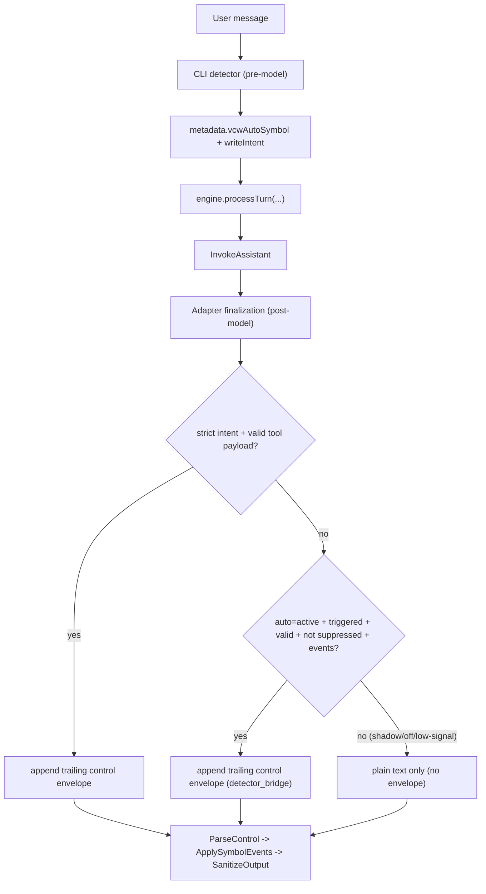

# Phase Runbook 8: Automatic Symbol Recognition Mode (Passive Memory Capture)

## 1) Goal and Boundaries
### Goal
Enable passive symbol capture without requiring `/remember`, while preserving engine invariants and policy-controlled writes.

### Boundaries
- In scope: deterministic recognition module, auto metadata bridge, CLI auto mode controls, additive tests/docs.
- Out of scope: model-judged recognition, persistence beyond in-memory runtime, changes to Phase 4/5 gate math.

## 2) Prerequisites and Inputs
- Phase 7 PASS baseline.
- Existing strict write-intent path remains canonical for explicit `/remember`.
- One-call invariant remains required at engine boundary.

## 3) Exact Task Sequence
1. Add recognition module (`src/recognition`) with deterministic rule scoring and metadata envelope helpers.
2. Add `auto` write-intent mode and `detector_bridge` transport to LangChain contracts.
3. Update LangChain assistant adapter:
   - strict mode unchanged (fail-fast)
   - auto mode passive (non-fatal on missing/invalid metadata)
   - ensure trailing control envelope remains trailing after middleware.
4. Update createAgent assistant runtime to append detector-bridged control envelope for active auto turns only.
5. Update chat and agent CLIs:
   - add `/auto on|off|shadow|status`
   - chat default `shadow`, agent default `active`
   - env override `VCW_AUTO_SYMBOL_MODE=off|shadow|active`.
6. Add deterministic dedupe for same slot/content (`profile:*` and `auto:<sha1_12>` IDs).
7. Add/expand tests for detector behavior, auto bridge integration, CLI mode behavior, and strict regression safety.
8. Update README and ADR/sign-off artifacts.

### 3A) Runtime Flow Clarification (Pre-Model Detector, Post-Model Envelope)


Clarifications:
- `shadow` is detect-only. It records recognition diagnostics and never writes.
- Detector execution is pre-model; write application remains in kernel parse/apply stages.

### 3B) Heuristic Scorer v2 (Pre-ML Increment)
- Scorer version: `heuristic_v2`
- Formula:
  - `z = bias + Σ(weight_i * feature_i)`
  - `p = sigmoid(z)`
- Constants:
  - `bias = -1.35`
  - `is_explicit_remember = +2.60`
  - `is_profile_name = +2.20`
  - `is_profile_location = +1.95`
  - `is_profile_occupation = +1.85`
  - `is_durable_preference = +1.15`
  - `is_project_plan = +1.05`
  - `has_first_person_pronoun = +0.35`
  - `has_declarative_verb = +0.30`
  - `has_hedge_phrase = -0.65`
  - `has_transient_marker = -0.55`
  - `is_question_like = -1.25`
  - `is_command_like = -1.25`
  - `is_too_short = -0.80`
  - `is_very_long = -0.20`
- Conservative thresholds:
  - `activeMinScore = 0.84`
  - `shadowMinScore = 0.50`
- Band mapping:
  - `write`: `p >= activeMinScore`
  - `shadow`: `shadowMinScore <= p < activeMinScore`
  - `suppress`: `p < shadowMinScore`
- Hard policy locks:
  - Secret patterns always suppress.
  - In `active` mode, `explicit_remember_cue` + profile slot assertions (`name/location/occupation`) force write via override.
  - `durable_preference_statement` and `project_plan_statement` rely on weighted score bands.

## 4) Required Commands and Checks
```bash
bun test
bun run test:chat-cli
bun run test:agent
bun run chat:interactive --mock --once "my name is Jason" --trace
VCW_AUTO_SYMBOL_MODE=active bun run agent:interactive --mock --once "my name is Jason" --trace
VCW_AUTO_SYMBOL_MODE=active bun run agent:interactive --mock --once "my favorite color is green" --trace
bun x tsc --noEmit
rg -n "WriteIntentMode|detector_bridge|vcwAutoSymbol|/auto on\|off\|shadow\|status" src
rg -n "RecognitionScoring|scoreBand|overrideApplied|autoTopFeatures" src
```

## 5) Expected Artifacts and File Outputs
- Recognition module:
  - `src/recognition/contracts.ts`
  - `src/recognition/detector.ts`
  - `src/recognition/index.ts`
- Adapter/runtime changes:
  - `src/integrations/langchain/contracts.ts`
  - `src/integrations/langchain/assistant.ts`
  - `src/integrations/langchain/agent-assistant.ts`
  - `src/chat-cli/*`
  - `src/agent-cli/*`
- Tests:
  - `tests/recognition/detector.test.ts`
  - `tests/recognition/scoring.test.ts`
  - `tests/langchain/assistant-auto-intent.test.ts`
  - `tests/chat-cli/auto-mode.test.ts`
  - `tests/agent-cli/auto-mode.test.ts`
- Docs:
  - `docs/greenfield-engine-v2/PHASE_RUNBOOK_8.md`
  - `docs/greenfield-engine-v2/DECISION_LOG.md`
  - `README.md`

## 6) Pass/Fail Checks and Rollback Trigger
### Pass
- Agent CLI can capture high-confidence facts passively without `/remember`.
- Chat CLI defaults to shadow mode with diagnostics and no passive writes.
- Strict mode remains fail-fast and unchanged for explicit write turns.
- No memory write tools are reintroduced into agent tool loop.
- All required commands pass.

### Fail
- Any one-call invariant regression.
- Passive mode writes that bypass parser/policy/applier semantics.
- Auto mode causes hard turn failures for ordinary non-intent turns.

### Rollback trigger
- Recursion-limit regressions, uncontrolled write loops, or repeated false-positive passive writes after merge candidate cut.

## 7) Handoff Notes to Next Phase
- Phase 9 may layer confidence learning, finer privacy controls, and persistence-backed memory lifecycles.
- Phase 8 establishes deterministic passive capture with explicit observability and rollback-safe defaults.
